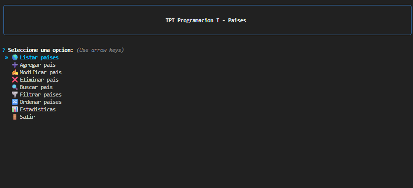
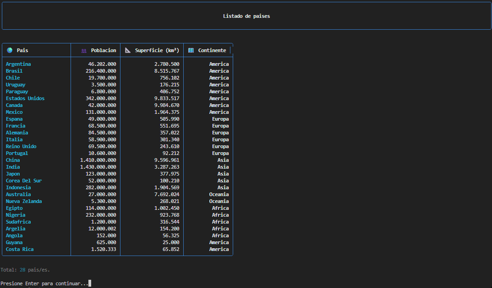
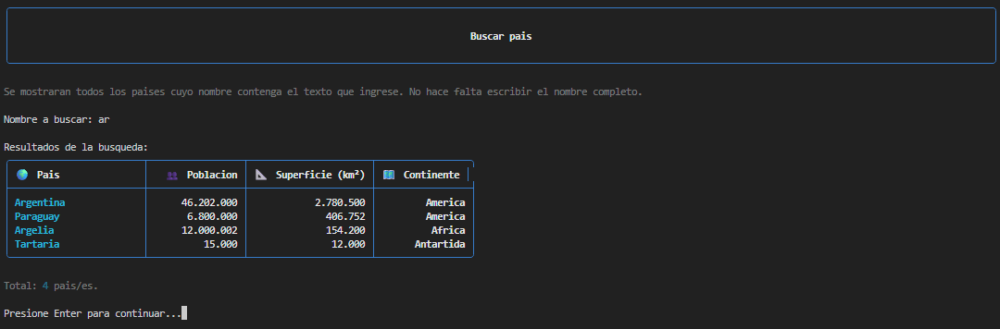

# Trabajo Práctico Integrador - Programación I

Repositorio correspondiente al Trabajo Práctico Integrador de la materia **Programación I** (UTN FRM).

## Descripción

El programa permite gestionar información de países a partir de un archivo CSV. Mediante un **menú interactivo en consola**, el usuario puede listar, agregar, modificar, eliminar y buscar países, así como filtrarlos, ordenarlos y consultar estadísticas de forma intuitiva.

El proyecto está organizado en módulos dentro de la carpeta `functions/` para facilitar el desarrollo y la lectura del código.

## Integrantes

| Nombre | Legajo | Correo |
|---|---|---|
| Lautaro Martinez | 54277 | lautaroj.martinez@alumnos.frm.utn.edu.ar |
| Luciano Pizarro | 54249 | luciano.pizarro@alumnos.frm.utn.edu.ar |

## Enlaces del proyecto

| Recurso | Enlace |
|---|---|
| Repositorio GitHub | [https://github.com/lauto554/TPI](https://github.com/lauto554/TPI) |
| Video demostración | https://youtu.be/QkSYSbyWUUA |
| Informe PDF | /informe.pdf |

## Requisitos previos

Para ejecutar el programa es necesario contar con:

1. **Python 3.x** instalado en el sistema (se recomienda una versión 3.10 o superior).
2. Las dependencias del proyecto, instaladas **exclusivamente** desde el archivo `requirements.txt`.

### Instalación de dependencias

Desde la carpeta del proyecto:

```bash
pip install -r requirements.txt
```

Si tenés más de una versión de Python instalada, verificá que `pip` corresponda al mismo intérprete con el que vas a ejecutar el programa:

```bash
python -m pip install -r requirements.txt
```

Las librerías necesarias son `questionary` (menú interactivo) y `rich` (formato en consola).

## Ejecución

Desde la carpeta del proyecto:

```bash
python main.py
```

Al iniciar, el usuario se encontrará con un **menú interactivo** donde podrá elegir las distintas operaciones del sistema usando las flechas del teclado y confirmar con Enter.

Los datos se leen y guardan automáticamente en el archivo `paises.csv`.

## Estructura del proyecto

```text
main.py                  Punto de entrada del programa
functions/
  menu.py                Menú principal
  datos.py               Carga, guardado y gestión de países
  filtros.py             Funciones de búsqueda y filtrado
  ordenamientos.py       Funciones de ordenamiento
  estadisticas.py        Cálculos y estadísticas
  utils.py               Funciones auxiliares
  estilos.py             Tablas y formato visual
  dependencias.py        Verificación de librerías al inicio
paises.csv               Dataset de países
requirements.txt         Dependencias del proyecto
assets/                  Capturas de pantalla para este README
```

## Formato de datos

Cada país se representa mediante un diccionario con la siguiente estructura:

```python
pais = {
    "nombre": "Argentina",
    "poblacion": 45376763,
    "superficie": 2780400,
    "continente": "America"
}
```

La colección de países se maneja como una lista de diccionarios.

## Ejemplos de uso

Las capturas deben guardarse en la carpeta `assets/`.

### Menú principal

**Entrada:** ejecutar `python main.py`

**Salida:** menú interactivo con las opciones del sistema (listar, agregar, modificar, eliminar, buscar, filtrar, ordenar, estadísticas y salir).

<p align="center">
  
</p>

---

### Listar países

**Entrada:** seleccionar `Listar paises`

**Salida:** tabla con nombre, población, superficie y continente de todos los países cargados en `paises.csv`.

<p align="center">
  
</p>

---

### Buscar país (coincidencia parcial)

**Entrada:** seleccionar `Buscar pais` → ingresar `arg`

**Salida:** países cuyo nombre contiene `"arg"` (por ejemplo, Argentina).

<p align="center">
  
</p>
